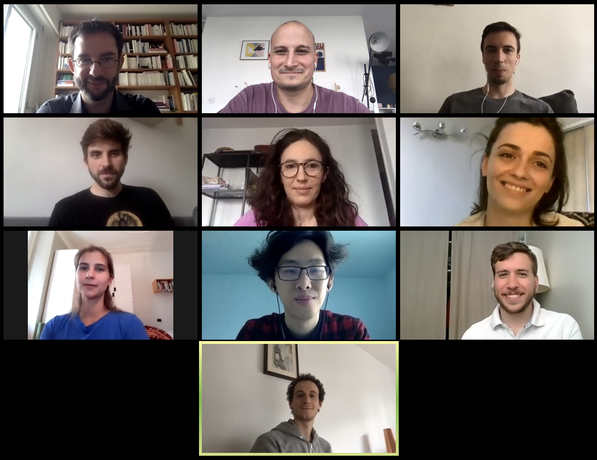

Current members
===============

* Mathieu Salanne is the principal investigator of the project.

* Camille Bacon is a PhD student working on the simulation of innovative electrolytes (organic and ionic liquids) in contact with nanoporous carbon electrodes for supercapacitor applications (co-direction by Patrice Simon and Mathieu Salanne).

* Roxanne Berthin is a PhD student. She works on the development of classical molecular dynamics simulations to study biredox ionic liquids (co-direction by Olivier Fontaine and Mathieu Salanne).

* Sheng Bi is a post-doc working on the simulation of electrode materials involving multi-component species and their applications to supercapacitors.

* Kateryna Goloviznina is a post-doc working on the simulation of redox active species in ionic liquids electrolytes.

* Tzu-Yao Hsu is a PhD student funded by the Ministry of Higher Education, Research and Innovation (co-direction by Guillaume Jeanmairet and Mathieu Salanne). He develops a molecular density functional approach to study redox reactions.

* Arthur France-Lanord is a post-doc funded by the French National Research Agency (project in collaboration with Alexis Grimaud, Olivier Fontaine and Jean-Marie Tarascon). He is studying the formation of the solid electrolyte interphase formed in aqueous batteries by *ab initio* molecular dynamics.

* Alessandra Serva is a post-doc working on the development of polarizable force fields for organic and ionic liquid electrolytes at carbon interfaces and their application to the study of biredox ionic liquids.

* Guillaume Jeanmairet is a CNRS researcher. Within AMPERE, he mainly works on the development of molecular density functional theory for 
electrochemical applications.

* Benjamin Rotenberg is a senior CNRS researcher. Within AMPERE, he mainly works on the development of new models for the simulation of electrodes accounting for the metallicity of the material, and on the statistical mechanics of constant potential molecular dynamics simulations.

Past members
============

* Zhujie Li defended his PhD on the study of water-in-salts electrolytes for supercapacitor applications in November 2018. After a post-doc at the University of Freiburg, he joined the  Advanced Technology Research Institute, Beijing Institute of Technology

* Trinidad Mendez-Morales focused during her post-doc on the study of physico-chemical properties of water-in-salts electrolytes. She is now a post-doc at the University of A Coruña.

* Thomas Dufils developed a Thomas-Fermi model to account for the screening of the electrostatic interactions within electrode materials during his post-doc. He is now a post-doc at Uppsala University.

* Kyle Reeves studied the redox reactions of biredox ionic species using *ab initio* molecular dynamics. He is now working at the CEA within the EoCoE project. 

* Matthieu Haefele is a research engineer at CNRS. He worked on all the computational aspects of the development of the MetalWalls software at Maison de la Simulation. He is now working at the Université de Pau et des Pays de l'Adour.

Collaborators
=============

* Laura Scalfi graduated from Sorbonne University in 2021 under the direction of Benjamin Rotenberg. She studied the impact of metallicity of electrodes on the freezing of ionic liquids and is one of the main developers of the MetalWalls software. She is now a post-doc at the Freie Universitat Berlin. 

* Alessandro Coretti graduated in Mathematics at Politecnico di Torino under the direction by Sara Bonella. He worked on the development and the implementation of new algorithms dedicated to the study of constant potential electrodes and polarizable force fields, and is one of the main developers of the MetalWalls software. He is now a post-doc at the University of Vienna.

* Sara Bonella is professor at École Polytechnique Fédérale de Lausanne. Within AMPERE, she mainly works on the development of new algorithms dedicated to the study of constant potential electrodes and polarizable force fields.

* Olivier Fontaine is assistant professor at the University of Montpellier. He discovered biredox ionic liquids and contributes to the project by providing experimental input for validating the simulations.

* Céline Merlet is a CNRS researcher at the University of Toulouse. She works on the development of new approaches to interpret experiments using classical molecular dynamics simulations.

* Patrice Simon is professor at the University of Toulouse. He is one of the main experts of supercapacitors worldwide and contributes to the project by providing experimental input for validating the simulations.

* Nicolas Dubouis graduated from Sorbonne University in 2021 under the direction by Alexis Grimaud. He worked on the study of aqueous electrolytes for batteries and catalysis applications.

* Alexis Grimaud is a CNRS researcher at Collège de France. He works on the study of aqueous electrolytes for batteries and catalysis applications.

* Michiel Sprik is professor at Cambridge University. He works on the development of applied field methods to simulate electrochemical systems.

* Paul Madden is professor at Oxford University. He developed the first version of MetalWalls and of many of the methods implemented in the software.

